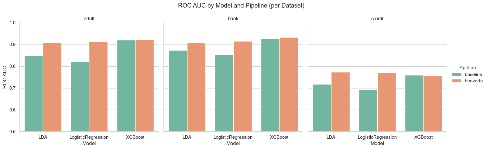
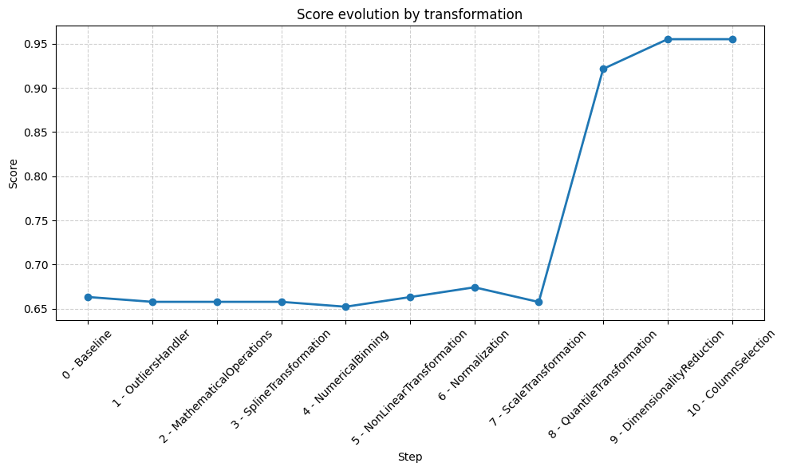

[](https://pepy.tech/projects/beaverfe)


---

# **Beaver FE**

*A Versatile Toolkit for Automated Feature Engineering in Machine Learning*

**Beaver FE** is a Python library that streamlines feature engineering for machine learning. It provides robust tools for preprocessing tasks such as scaling, normalization, feature creation (e.g., binning, mathematical operations), and encoding. It improves data quality and boosts model performance with minimal manual effort.

## 📌 Table of Contents
- [**Beaver FE**](#beaver-fe)
  - [📌 Table of Contents](#-table-of-contents)
  - [🚀 Getting Started](#-getting-started)
  - [📖 Usage Examples](#-usage-examples)
    - [🤖 Automated Feature Engineering](#-automated-feature-engineering)
    - [🔧 Manual Transformations](#-manual-transformations)
    - [💾 Saving and Loading Transformations](#-saving-and-loading-transformations)
  - [📊 Benchmark Results](#-benchmark-results)
  - [🔎 Transformation Evaluation](#-transformation-evaluation)
    - [Example](#example)
    - [Output](#output)
  - [🧩 Core API](#-core-api)
    - [**auto\_feature\_pipeline**](#auto_feature_pipeline)
      - [**Parameters:**](#parameters)
      - [**Execution Order:**](#execution-order)
      - [**Returns:**](#returns)
    - [**BeaverPipeline**](#beaverpipeline)
      - [**Constructor Parameters:**](#constructor-parameters)
      - [**Public Methods:**](#public-methods)
    - [**evaluate\_transformations**](#evaluate_transformations)
      - [**Parameters:**](#parameters-1)
      - [**Returns:**](#returns-1)
  - [🔍 Available Transformations](#-available-transformations)
  - [🛠️ Contributing](#️-contributing)
  - [📄 License](#-license)


<a id="getting-started"></a>
## 🚀 Getting Started

Install Beaver FE using pip:

```bash
pip install beaverfe
```

<a id="usage-examples"></a>
## 📖 Usage Examples

<a id="automated-feature-engineering"></a>
### 🤖 Automated Feature Engineering

Automatically optimize feature transformations using a given model and metric:

```python
from beaverfe import auto_feature_pipeline, BeaverPipeline
from sklearn.neighbors import KNeighborsClassifier

model = KNeighborsClassifier()
transformations = auto_feature_pipeline(x, y, model, scoring="accuracy", direction="maximize")

bfe = BeaverPipeline(transformations)
x_train = bfe.fit_transform(x_train, y_train)
x_test = bfe.transform(x_test, y_test)
```


<a id="manual-transformations"></a>
### 🔧 Manual Transformations

```python
from beaverfe import BeaverPipeline
from beaverfe.transformations import (
    MathematicalOperations,
    NumericalBinning,
    OutliersHandler,
    ScaleTransformation,
)

# Define transformations
transformations = [
    OutliersHandler(
        transformation_options={
            "sepal length (cm)": ("median", "iqr"),
            "sepal width (cm)": ("cap", "zscore"),
        },
        thresholds={
            "sepal length (cm)": 1.5,
            "sepal width (cm)": 2.5,
        },
    ),
    ScaleTransformation(
        transformation_options={
            "sepal length (cm)": "min_max",
            "sepal width (cm)": "robust",
        },
        quantile_range={
            "sepal width (cm)": (25.0, 75.0),
        },
    ),
    NumericalBinning(
        transformation_options={
            "sepal length (cm)": ("uniform", 5),
        }
    ),
    MathematicalOperations(
        operations_options=[
            ("sepal length (cm)", "sepal width (cm)", "add"),
        ]
    ),
]

bfe = BeaverPipeline(transformations)

x_train = bfe.fit_transform(x_train, y_train)
x_test = bfe.transform(x_test, y_test)
```

<a id="saving-and-loading-pipelines"></a>
### 💾 Saving and Loading Transformations

Save your pipeline for reuse across sessions:

```python
import pickle
from beaverfe import BeaverPipeline

bfe = BeaverPipeline(transformations)

# Save pipeline parameters
with open("beaverfe_transformations.pkl", "wb") as f:
    pickle.dump(bfe.get_params(), f)

# Load pipeline parameters
with open("beaverfe_transformations.pkl", "rb") as f:
    params = pickle.load(f)

bfe.set_params(**params)
```

---

<a id="benchmark-results"></a>
## 📊 Benchmark Results

Beaver FE was evaluated on several datasets and models to assess its impact on model performance. The table below compares baseline accuracy versus accuracy after applying Beaver FE transformations:

| Dataset | Model                | Baseline | BeaverFE | Improvement |
|---------|----------------------|----------|----------|-------------|
| **adult** |                      |          |          |             |
|          | LDA                  | 0.848    | 0.905    | +6.72%      |
|          | LogisticRegression   | 0.822    | 0.903    | +9.85%      |
|          | XGBoost              | 0.921    | 0.923    | +0.22%      |
| **bank**  |                      |          |          |             |
|          | LDA                  | 0.874    | 0.911    | +4.23%      |
|          | LogisticRegression   | 0.854    | 0.904    | +5.85%      |
|          | XGBoost              | 0.927    | 0.932    | +0.54%      |
| **credit**|                      |          |          |             |
|          | LDA                  | 0.717    | 0.762    | +6.28%      |
|          | LogisticRegression   | 0.696    | 0.763    | +9.63%      |
|          | XGBoost              | 0.760    | 0.761    | +0.13%      |




---

<a id="transformation-evaluation"></a>
## 🔎 Transformation Evaluation

To better understand the impact of each transformation applied with **Beaver FE**, you can use the function `evaluate_transformations`.
This utility evaluates the model performance after each incremental transformation and generates a plot showing the **score evolution** step by step.

### Example

```python
from beaverfe import evaluate_transformations

scores = evaluate_transformations(
    transformations,     # list of Beaver transformations
    X,                   # input features
    y,                   # labels
    model,               # estimator to evaluate
    scoring="accuracy",  # evaluation metric
    cv=5,                # cross-validation folds
    groups=None,         # optional group labels for grouped CV
    plot_file="performance_evolution.png",
    max_steps=None,      # limit evaluation to first N transformations
)

print(scores)
```

### Output

* **Scores list**:
  A list of dictionaries with the score after each step, starting with the baseline (no transformations):

```python
[
    {"name": "Baseline", "score": 0.663}
    {"name": "OutliersHandler", "score": 0.658}
    {"name": "MathematicalOperations", "score": 0.658}
    {"name": "SplineTransformation", "score": 0.658}
    {"name": "NumericalBinning", "score": 0.652}
    {"name": "NonLinearTransformation", "score": 0.663}
    {"name": "Normalization", "score": 0.674}
    {"name": "ScaleTransformation", "score": 0.658}
    {"name": "QuantileTransformation", "score": 0.922}
    {"name": "DimensionalityReduction", "score": 0.955}
    {"name": "ColumnSelection", "score": 0.955}
]
```

* **Evolution plot**:
  The function also generates a line chart saved to `performance_evolution.png`.
  Each transformation is **enumerated** to avoid duplicate names, making it clear how performance evolves:



---

<a id="core-api"></a>
## 🧩 Core API

<a id="auto_feature_pipeline"></a>
### **auto_feature_pipeline**

Automatically finds and applies optimal transformations to improve model performance using Bayesian optimisation (Optuna).

```python
from beaverfe import auto_feature_pipeline
```

#### **Parameters:**

- `X` (`pd.DataFrame`): Feature matrix.
- `y` (`np.ndarray`): Target variable.
- `model`: A scikit-learn-compatible estimator implementing a `fit` method.
- `scoring` (`str`): Evaluation metric (e.g., `"accuracy"`, `"f1"`, `"roc_auc"`).
- `direction` (`str`, optional): Optimization direction: `"maximize"` or `"minimize"`. Default is `"maximize"`.
- `cv` (`int` or callable, optional): Cross-validation strategy (e.g., number of folds or a custom splitter). Default is `None`.
- `groups` (`np.ndarray`, optional): Group labels for cross-validation. Useful for grouped CV. Default is `None`.
- `timeout` (`int` or `None`, optional): Time budget in seconds for the Bayesian optimisation search. Default is `600`. Set to `None` to disable the time limit.
- `n_trials` (`int` or `None`, optional): Maximum number of Optuna trials. Default is `100`. Set to `None` to disable the trial limit.
- `verbose` (`bool`, optional): Whether to display progress logs. Default is `True`.

#### **Execution Order:**

Transformations are applied in the following canonical order:

1. Datetime feature extraction
2. Missing value indicators
3. Missing value imputation
4. Cyclical feature expansion
5. Outlier handling
6. Mathematical operations
7. Spline transformations
8. Numerical binning
9. Categorical encoding
10. Normalisation (exclusive per-column choice: non-linear / scaling / quantile)
11. Dimensionality reduction

#### **Returns:**

* `list[dict]`: A list of transformation configurations (each with `"name"` and `"params"` keys) that can be passed directly to `BeaverPipeline`.

---

<a id="beaverpipeline"></a>
### **BeaverPipeline**

A scikit-learn compatible pipeline that applies a sequence of transformations.

```python
from beaverfe import BeaverPipeline
```

#### **Constructor Parameters:**
- `transformations` (`list[dict]`, optional): List of transformation dictionaries (each with `"name"` and `"params"` keys), or a list of initialised transformer objects. Default is `None`.
- `order` (`list[PipelineBlock]`, optional): Custom execution order for the pipeline blocks. When provided, transformation dicts are sorted by this order before being applied. Defaults to `None` (preserves input order). Use `CANONICAL_ORDER` from `beaverfe.pipeline_blocks` for the recommended production order.

#### **Public Methods:**

- `fit(X, y=None)`
    Fits each transformation in the pipeline to the dataset sequentially, passing the transformed output of each step as input to the next.
    - **Returns:** `self`

- `transform(X, y=None)`
    Applies each fitted transformation in sequence.
    - **Returns:** Transformed feature matrix (`pd.DataFrame`)

- `fit_transform(X, y=None)`
    Combines `fit` and `transform` for each transformation.
    - **Returns:** Transformed feature matrix.

- `get_params(deep=True)`
    Retrieves the pipeline parameters (inherited from `sklearn.BaseEstimator`).
    - **Returns:** Dictionary of parameters.

- `set_params(**params)`
    Sets or updates the pipeline parameters (inherited from `sklearn.BaseEstimator`).
    - **Returns:** `self`

---

<a id="evaluate_transformations"></a>
### **evaluate_transformations**

Evaluates a model by incrementally applying transformations and plots the score evolution.

```python
from beaverfe import evaluate_transformations
```

#### **Parameters:**

- `transformations` (`list[dict]`): List of transformations in Beaver format.
- `X` (`pd.DataFrame`): Feature matrix.
- `y` (`np.ndarray`): Labels.
- `model`: Scikit-learn-compatible estimator.
- `scoring` (`str`): Evaluation metric (e.g., `"accuracy"`, `"roc_auc"`).
- `cv` (`int` or callable, optional): Cross-validation strategy. Default is `None`.
- `groups` (`np.ndarray`, optional): Group labels for cross-validation. Default is `None`.
- `plot_file` (`str` or `None`, optional): Path where the score evolution chart is saved. Default is `"performance_evolution.png"`. Set to `None` to skip plotting.
- `max_steps` (`int` or `None`, optional): Limit evaluation to the first N transformations. Useful for large recipes or big datasets. Default is `None` (evaluate all steps).

#### **Returns:**

* `list[dict]`: A list of `{"name": str, "score": float}` dicts, one per step starting from the baseline.

> **Note:** This function runs one full cross-validation per step, so for T transformations with cv=5 it requires 5T + 5 model fits. Use `max_steps` to control evaluation cost.

---

<a id="available-transformations"></a>
## 🔍 Available Transformations

For the full reference of all transformers, parameters, and code examples see [TRANSFORMATIONS.md](TRANSFORMATIONS.md).

---

<a id="contributing"></a>
## 🛠️ Contributing

We welcome contributions! Please submit pull requests, open issues, or share suggestions to improve Beaver FE.

---

<a id="license"></a>
## 📄 License

Beaver FE is open-source software distributed under the MIT License.

---

**🚀 Power up your ML workflows with intelligent, flexible feature engineering — with just a few lines of code. Try Beaver FE today!**
